```mermaid
graph LR
    A[1. Reconnaissance] --> B[2. Scanning]
    B --> C[3. Enumeration]
    C --> D[4. Exploitation]
    D --> E[5. Post-Exploitation]
    E --> F[6. Privilege Escalation]
    F --> G[7. Reporting]
    
    style A fill:#00ffcc,stroke:#000,stroke-width:2px,color:#000
    style B fill:#00ff00,stroke:#000,stroke-width:2px,color:#000
    style C fill:#ffd700,stroke:#000,stroke-width:2px,color:#000
    style D fill:#ff6b6b,stroke:#000,stroke-width:2px,color:#000
    style E fill:#ff073a,stroke:#000,stroke-width:2px,color:#000
    style F fill:#b620e0,stroke:#000,stroke-width:2px,color:#000
    style G fill:#4ecdc4,stroke:#000,stroke-width:2px,color:#000
```

<div align="center">

<!-- Animated Header -->


<!-- Typing Animation -->
<p align="center">
  <a href="https://git.io/typing-svg">
    
  </a>
</p>

<!-- Badges Row 1 -->
<p align="center">
  
  
  
  
</p>

<!-- Badges Row 2 -->
<p align="center">
  
  
  
  
</p>

<!-- Social Links -->
<p align="center">
  <a href="https://dharmendrastm.github.io/PortfolioWebsite/">
    
  </a>
  <a href="https://www.linkedin.com/in/dharmendrastm/">
    
  </a>
  <a href="https://github.com/dharmendrastm">
    
  </a>
  <a href="https://medium.com/@dharmendrastm">
    
  </a>
</p>

<!-- Quote -->
<p align="center">
  
</p>

<!-- Profile Views Counter -->
<p align="center">
  
  
  
</p>

</div>

---

## 🎯 Professional Summary

```ascii
┏━━━━━━━━━━━━━━━━━━━━━━━━━━━━━━━━━━━━━━━━━━━━━━━━━━━━━━━━━━━━━━━━━━━━━━━━┓
┃                                                                          ┃
┃  🛡️  Certified Junior Penetration Tester (eJPT) with expertise in      ┃
┃      offensive security, web application security (VAPT), and           ┃
┃      vulnerability research.                                            ┃
┃                                                                          ┃
┃  🎯  Recognized in Bug Bounty Hall of Fame for responsible disclosure   ┃
┃      of critical security vulnerabilities.                              ┃
┃                                                                          ┃
┃  🚀  Active CTF player on Hack The Box, TryHackMe & PortSwigger Labs    ┃
┃      with hands-on experience in real-world security challenges.        ┃
┃                                                                          ┃
┃  💡  Passionate about Red Teaming, Network Security, OSINT, and         ┃
┃      building open-source security tools for the community.             ┃
┃                                                                          ┃
┗━━━━━━━━━━━━━━━━━━━━━━━━━━━━━━━━━━━━━━━━━━━━━━━━━━━━━━━━━━━━━━━━━━━━━━━━┛
```

<div align="center">

### 🔥 Current Mission

</div>

<table align="center">
<tr>
<td align="center" width="33%">

<br><br>
Preparing for <b>Active Directory Red Team Specialist</b> certification with focus on AD exploitation, lateral movement, and privilege escalation techniques.
</td>
<td align="center" width="33%">

<br><br>
Actively participating in <b>Bug Bounty Programs</b> on Bugcrowd and HackerOne, specializing in web application security and OWASP Top 10 vulnerabilities.
</td>
<td align="center" width="33%">

<br><br>
Developing <b>Open-Source Security Tools</b> including OSINT platforms, reconnaissance frameworks, and automated vulnerability scanners.
</td>
</tr>
</table>

---

## 🏆 Honors & Awards

<div align="center">


<table>
<tr>
<td align="center" width="100%">

### 🥇 Dreamscape Networks Hall of Fame


<br><br>

**Achievement:** Recognized for responsibly disclosing a **critical Session Management vulnerability** that could have allowed:
- ⚠️ Unauthorized access to user accounts
- 🔓 Session hijacking and misuse
- 💾 Potential compromise of user data and system integrity

<br>

**Impact:** This disclosure prevented potential security breaches affecting thousands of users and demonstrated commitment to **ethical hacking** and **responsible disclosure practices**.

<br>


</td>
</tr>
</table>

### 🎖️ Additional Recognitions

<p align="center">


</p>

</div>

---

## 📜 Certifications & Credentials

<div align="center">

### 🎓 Professional Certifications


</div>

<details open>
<summary><b>🔐 Industry Certifications (Click to expand/collapse)</b></summary>

<br>

<table>
<tr>
<th width="35%">Certification</th>
<th width="15%">Issuer</th>
<th width="12%">Date</th>
<th width="18%">Credential ID</th>
<th width="20%">Status</th>
</tr>

<tr>
<td>

<br><br>
<b>Core Skills:</b>
<br>• Exploitation & Post-Exploitation
<br>• Privilege Escalation (Linux/Windows)
<br>• Information Gathering
<br>• Vulnerability Assessment
<br>• Network Penetration Testing
</td>
<td align="center"><b>INE</b></td>
<td align="center">Nov 2025</td>
<td align="center"><code>164839576</code></td>
<td align="center">

</td>
</tr>

<tr>
<td>

<br><br>
<b>Core Skills:</b>
<br>• Ethical Hacking Fundamentals
<br>• Network Security
<br>• System Hacking Basics
<br>• Wireless Network Hacking
<br>• Footprinting & Reconnaissance
<br>• Penetration Testing Methodology
</td>
<td align="center"><b>EC-Council</b></td>
<td align="center">Aug 2024</td>
<td align="center"><code>350242</code></td>
<td align="center">

</td>
</tr>

<tr>
<td>

<br><br>
<b>Core Skills:</b>
<br>• Broken Access Control
<br>• Cryptographic Failures
<br>• Injection Attacks (SQL, XSS, etc.)
<br>• Insecure Design
<br>• Security Misconfiguration
<br>• SSRF & Authentication Failures
</td>
<td align="center"><b>Cybrary</b></td>
<td align="center">Aug 2024</td>
<td align="center"><code>CC-bdfa51c8</code></td>
<td align="center">

</td>
</tr>

<tr>
<td>

<br><br>
<b>Core Skills:</b>
<br>• SQL Injection Techniques
<br>• SQLMap Automation
<br>• Database Exploitation
<br>• Input Validation & Bypassing
<br>• SQL Basics & Advanced Queries
</td>
<td align="center"><b>EC-Council</b></td>
<td align="center">Jun 2024</td>
<td align="center"><code>339330</code></td>
<td align="center">

</td>
</tr>

<tr>
<td>

<br><br>
<b>Core Skills:</b>
<br>• Cybersecurity Fundamentals
<br>• Privacy Protection Mechanisms
<br>• Cryptography Basics
<br>• Secure System Design
</td>
<td align="center"><b>NPTEL</b></td>
<td align="center">Nov 2024</td>
<td align="center"><code>NPTEL24CS121S1050101544</code></td>
<td align="center">

</td>
</tr>

</table>

</details>

<details>
<summary><b>🎯 Platform Certifications & Training</b></summary>

<br>

<table>
<tr>
<th width="35%">Program</th>
<th width="15%">Platform</th>
<th width="12%">Date</th>
<th width="18%">Credential ID</th>
<th width="20%">Focus Areas</th>
</tr>

<tr>
<td>

<br><br>
<b>Skills Acquired:</b>
<br>• Network Security Fundamentals
<br>• Metasploit Framework
<br>• Burp Suite Mastery
<br>• Enumeration & Exploitation
<br>• Professional Reporting
</td>
<td align="center"><b>TryHackMe</b></td>
<td align="center">Aug 2024</td>
<td align="center"><code>THM-CERT</code></td>
<td align="center">

</td>
</tr>

<tr>
<td>

<br><br>
<b>Skills Acquired:</b>
<br>• Angry IP Scanner
<br>• Network Reconnaissance (Nslookup)
<br>• Website Cloning (HTTrack)
<br>• Social Engineering (Zphisher)
<br>• Malware Analysis
<br>• Linux & Windows Commands
</td>
<td align="center"><b>InternsElite</b></td>
<td align="center">Aug 2024</td>
<td align="center"><code>IT/2024/CS-T9/3590</code></td>
<td align="center">

</td>
</tr>

<tr>
<td>

</td>
<td align="center"><b>TryHackMe</b></td>
<td align="center">Aug 2024</td>
<td align="center">—</td>
<td align="center">Web Security</td>
</tr>

<tr>
<td>

</td>
<td align="center"><b>TryHackMe</b></td>
<td align="center">Jul 2024</td>
<td align="center">—</td>
<td align="center">Fundamentals</td>
</tr>

<tr>
<td>

</td>
<td align="center"><b>TryHackMe</b></td>
<td align="center">Jun 2024</td>
<td align="center">—</td>
<td align="center">Basics</td>
</tr>

</table>

</details>

---

## 🛠️ Security Arsenal & Technology Stack

<div align="center">

### 💻 Programming & Scripting Languages

<p>

</p>

<table>
<tr>
<td align="center" width="20%">

<br>
<sub><b>Primary Language</b></sub>
<br>
<sub>Automation, Exploits, Tools</sub>
</td>
<td align="center" width="20%">

<br>
<sub><b>Shell Scripting</b></sub>
<br>
<sub>Automation, Enumeration</sub>
</td>
<td align="center" width="20%">

<br>
<sub><b>Web Security</b></sub>
<br>
<sub>XSS, DOM Analysis</sub>
</td>
<td align="center" width="20%">

<br>
<sub><b>Low-Level</b></sub>
<br>
<sub>Buffer Overflow, Exploits</sub>
</td>
<td align="center" width="20%">

<br>
<sub><b>Database</b></sub>
<br>
<sub>SQLi, Database Exploitation</sub>
</td>
</tr>
</table>

---

### 🔧 Penetration Testing Tools & Frameworks

#### 🔍 Reconnaissance & OSINT

<p>


</p>

#### 🌐 Web Application Security

<p>


</p>

#### 💣 Exploitation & Post-Exploitation

<p>


</p>

#### 🔐 Password Cracking & Analysis

<p>


</p>

#### 📡 Wireless Security

<p>


</p>

#### 🖥️ Operating Systems

<p>


</p>

#### 🔒 Privacy & Anonymity

<p>


</p>

---

### 🧪 Training Platforms & CTFs

<table align="center">
<tr>
<td align="center" width="25%">

<br>
<sub><b>Pro Labs & Challenges</b></sub>
<br>

</td>
<td align="center" width="25%">

<br>
<sub><b>Learning Paths & Rooms</b></sub>
<br>

</td>
<td align="center" width="25%">

<br>
<sub><b>Web Security Academy</b></sub>
<br>

</td>
<td align="center" width="25%">

<br>
<sub><b>Practical Exercises</b></sub>
<br>

</td>
</tr>
</table>

---

### 🔨 My Custom Security Tools

<div align="center">


</div>

<table>
<tr>
<th width="25%">Tool</th>
<th width="45%">Description</th>
<th width="15%">Technology</th>
<th width="15%">Links</th>
</tr>

<tr>
<td align="center">

<br><br>


</td>
<td>
<b>Advanced OSINT & Recon Automation Platform</b>
<br><br>
• 250+ Pre-built Google Dorks
<br>• 24+ Vulnerability Categories
<br>• OWASP Top-25 Parameter Scanner
<br>• 150+ High-Risk URL Parameters
<br>• Automated Query Generation
<br>• Bug Bounty Optimized Workflow
<br>• Zero Configuration Required
<br>• Professional Cyber-Themed UI
<br><br>
<b>Use Cases:</b> OSINT, Reconnaissance, Parameter Discovery, Attack Surface Mapping
</td>
<td align="center">

<br>

<br>

<br><br>
<sub>Client-Side</sub>
<br>
<sub>No Backend</sub>
</td>
<td align="center">
<a href="https://dharmendrastm.github.io/SurfaceHunter/">

</a>
<br><br>
<a href="https://github.com/dharmendrastm/SurfaceHunter">

</a>
<br>
<a href="https://dharmendrastm.github.io/SurfaceHunter/">

</a>
</td>
</tr>

<tr>
<td align="center">

<br><br>


</td>
<td>
<b>Comprehensive Security Assessment Framework</b>
<br><br>
• Vulnerability Research Dashboard
<br>• Threat Intelligence Aggregator
<br>• Automated Security Scanning
<br>• Multi-Vector Attack Simulation
<br>• Real-Time Threat Monitoring
<br>• CVE Database Integration
<br>• Exploit Development Toolkit
<br>• Professional Reporting Module
<br><br>
<b>Use Cases:</b> Vulnerability Assessment, Threat Research, Security Auditing, Red Team Operations
</td>
<td align="center">

<br>

<br>

<br><br>
<sub>Client-Side</sub>
<br>
<sub>API Integration</sub>
</td>
<td align="center">
<a href="https://dharmendrastm.github.io/Threat-Matrix/">

</a>
<br><br>
<a href="https://github.com/dharmendrastm/Threat-Matrix">

</a>
<br>
<a href="https://dharmendrastm.github.io/Threat-Matrix/">

</a>
</td>
</tr>

</table>

<div align="center">

**🌟 Key Features of My Tools:**

<p>


</p>

</div>

---

### 🎨 Design & Development Stack

<p align="center">

</p>

</div>

---

## 💡 Core Competencies & Expertise

<div align="center">

### 🎯 Penetration Testing Methodology



</div>

<table>
<tr>
<th width="25%">Domain</th>
<th width="50%">Skills & Techniques</th>
<th width="25%">Proficiency</th>
</tr>

<tr>
<td>

</td>
<td>
• SQL Injection (In-Band, Blind, Time-Based)
<br>• Cross-Site Scripting (Reflected, Stored, DOM-Based)
<br>• CSRF & SSRF Exploitation
<br>• Authentication & Session Management Flaws
<br>• LFI/RFI & Path Traversal
<br>• XML External Entity (XXE) Injection
<br>• Insecure Deserialization
<br>• Business Logic Vulnerabilities
</td>
<td align="center">

<br><br>
<sub>5+ OWASP Certifications</sub>
<br>
<sub>100+ Web Labs Solved</sub>
</td>
</tr>

<tr>
<td>

</td>
<td>
• Google Dorking & Advanced Search Operators
<br>• Subdomain Enumeration (DNS, Scraping, Brute-Force)
<br>• Port Scanning & Service Detection
<br>• Social Media Intelligence (SOCMINT)
<br>• WHOIS, DNS, & Certificate Analysis
<br>• Email & Credential Harvesting
<br>• Metadata Extraction & Analysis
<br>• Dark Web Intelligence Gathering
</td>
<td align="center">

<br><br>
<sub>Custom OSINT Tools</sub>
<br>
<sub>Advanced Techniques</sub>
</td>
</tr>

<tr>
<td>

</td>
<td>
• Metasploit Framework Mastery
<br>• Manual Exploit Development
<br>• Buffer Overflow & ROP Chains
<br>• Remote Code Execution (RCE)
<br>• Privilege Escalation (Linux & Windows)
<br>• Lateral Movement Techniques
<br>• Persistence Mechanisms
<br>• Data Exfiltration Methods
</td>
<td align="center">

<br><br>
<sub>eJPT Certified</sub>
<br>
<sub>Practical Experience</sub>
</td>
</tr>

<tr>
<td>

</td>
<td>
• Network Scanning & Enumeration
<br>• Protocol Analysis (TCP/IP, HTTP, DNS)
<br>• Man-in-the-Middle (MITM) Attacks
<br>• Wireless Network Penetration
<br>• VPN & Firewall Bypass Techniques
<br>• Packet Capture & Analysis
<br>• Network Traffic Manipulation
<br>• ARP Spoofing & DNS Poisoning
</td>
<td align="center">

<br><br>
<sub>Network+ Knowledge</sub>
<br>
<sub>Practical Labs</sub>
</td>
</tr>

<tr>
<td>

</td>
<td>
• Automated Vulnerability Scanning
<br>• Manual Security Testing
<br>• Vulnerability Analysis & Prioritization
<br>• Risk Assessment & Scoring (CVSS)
<br>• Security Auditing & Compliance
<br>• Remediation Recommendations
<br>• False Positive Elimination
<br>• Continuous Security Monitoring
</td>
<td align="center">

<br><br>
<sub>VAPT Specialist</sub>
<br>
<sub>Bug Bounty Experience</sub>
</td>
</tr>

<tr>
<td>

</td>
<td>
• Professional Penetration Testing Reports
<br>• Executive Summaries & Technical Details
<br>• Vulnerability Documentation (CVE Format)
<br>• Proof-of-Concept (PoC) Development
<br>• Remediation Guidance & Best Practices
<br>• Responsible Disclosure Procedures
<br>• Security Awareness Training Material
<br>• Technical Writing & Communication
</td>
<td align="center">

<br><br>
<sub>Professional Reports</sub>
<br>
<sub>Clear Communication</sub>
</td>
</tr>

</table>

---

## 🛡️ OWASP Top 10 - 2021 Mastery

<div align="center">


</div>

<table>
<tr>
<th width="5%">#</th>
<th width="30%">Vulnerability</th>
<th width="40%">Understanding & Techniques</th>
<th width="25%">Proficiency</th>
</tr>

<tr>
<td align="center"><b>A01</b></td>
<td>

</td>
<td>
• IDOR (Insecure Direct Object References)
<br>• Path Traversal & Directory Listing
<br>• Privilege Escalation Vulnerabilities
<br>• Missing Function Level Access Control
</td>
<td align="center">

</td>
</tr>

<tr>
<td align="center"><b>A02</b></td>
<td>

</td>
<td>
• Weak Encryption Algorithms
<br>• Insecure Key Management
<br>• Sensitive Data Exposure
<br>• Certificate Validation Issues
</td>
<td align="center">

</td>
</tr>

<tr>
<td align="center"><b>A03</b></td>
<td>

</td>
<td>
• SQL Injection (All Types)
<br>• Command Injection (OS, LDAP, XPath)
<br>• NoSQL Injection
<br>• Template Injection (SSTI)
</td>
<td align="center">

</td>
</tr>

<tr>
<td align="center"><b>A04</b></td>
<td>

</td>
<td>
• Missing Security Controls
<br>• Threat Modeling Failures
<br>• Insecure Architecture Patterns
<br>• Business Logic Flaws
</td>
<td align="center">

</td>
</tr>

<tr>
<td align="center"><b>A05</b></td>
<td>

</td>
<td>
• Default Credentials & Configurations
<br>• Unnecessary Features Enabled
<br>• Error Handling Disclosure
<br>• Missing Security Headers
</td>
<td align="center">

</td>
</tr>

<tr>
<td align="center"><b>A06</b></td>
<td>

</td>
<td>
• Dependency Analysis
<br>• CVE Research & Exploitation
<br>• Version Detection Techniques
<br>• Supply Chain Security
</td>
<td align="center">

</td>
</tr>

<tr>
<td align="center"><b>A07</b></td>
<td>

</td>
<td>
• Brute Force & Credential Stuffing
<br>• Session Fixation & Hijacking
<br>• Weak Password Policies
<br>• Multi-Factor Authentication Bypass
</td>
<td align="center">

</td>
</tr>

<tr>
<td align="center"><b>A08</b></td>
<td>

</td>
<td>
• Insecure Deserialization
<br>• Code Integrity Verification
<br>• Untrusted CI/CD Pipeline
<br>• Auto-Update Mechanisms
</td>
<td align="center">

</td>
</tr>

<tr>
<td align="center"><b>A09</b></td>
<td>

</td>
<td>
• Log Tampering & Evasion
<br>• Insufficient Logging
<br>• Lack of Alerting Mechanisms
<br>• Incident Response Gaps
</td>
<td align="center">

</td>
</tr>

<tr>
<td align="center"><b>A10</b></td>
<td>

</td>
<td>
• Internal Network Scanning
<br>• Cloud Metadata Exploitation
<br>• Port Scanning via SSRF
<br>• Protocol Smuggling
</td>
<td align="center">

</td>
</tr>

</table>

<div align="center">

### 📊 Overall OWASP Top 10 Proficiency


</div>

---

## 📊 GitHub Analytics & Statistics

<div align="center">

### 🏆 Achievement Showcase


---

### 📈 Contribution Statistics

<table>
<tr>
<td width="50%">

</td>
<td width="50%">

</td>
</tr>
</table>

---

### 💻 Language Distribution


---

### 📅 Contribution Activity


---

### 🔥 GitHub Metrics

<table align="center">
<tr>
<td align="center">

</td>
<td align="center">

</td>
<td align="center">

</td>
<td align="center">

</td>
</tr>
</table>

</div>

---

## 🎓 Learning Journey & Roadmap

<div align="center">

### 📚 Continuous Learning Path

</div>

```ascii
┏━━━━━━━━━━━━━━━━━━━━━━━━━━━━━━━━━━━━━━━━━━━━━━━━━━━━━━━━━━━━━━━━━━━━━━━━━━━━━━┓
┃                       CYBERSECURITY LEARNING TIMELINE                          ┃
┗━━━━━━━━━━━━━━━━━━━━━━━━━━━━━━━━━━━━━━━━━━━━━━━━━━━━━━━━━━━━━━━━━━━━━━━━━━━━━━┛

2024 Q2  │  🌱 Foundation Phase
         │  ├─ Introduction to Cybersecurity (TryHackMe)
         │  ├─ SQL Injection Attacks (EC-Council) 
         │  └─ Pre Security Learning Path (TryHackMe)
         │
2024 Q3  │  🚀 Skill Development Phase
         │  ├─ Web Fundamentals (TryHackMe)
         │  ├─ Jr Penetration Tester Path (TryHackMe)
         │  ├─ OWASP Top 10 - 2021 (Cybrary)
         │  ├─ Ethical Hacking Essentials (EC-Council)
         │  └─ Cyber Security Internship (InternsElite)
         │
2024 Q4  │  📖 Academic Foundation
         │  └─ Cybersecurity & Privacy (NPTEL)
         │
2025 Q4  │  🏆 Professional Certification
         │  └─ eJPT Certification (INE) ✅ COMPLETED
         │
2025 Q1  │  🎯 Advanced Specialization (Current)
         │  ├─ Active Directory Red Team Specialist 🔄 IN PROGRESS
         │  ├─ Advanced Web Application Security
         │  ├─ Bug Bounty Hunter Advanced Techniques
         │  └─ Custom Security Tool Development
         │
2025 Q2  │  🚀 Future Goals (Planned)
         │  ├─ OSCP (Offensive Security Certified Professional)
         │  ├─ CRTP (Certified Red Team Professional)
         │  ├─ eWPT (eLearnSecurity Web Penetration Tester)
         │  └─ OSWE (Offensive Security Web Expert)
         │
2025+    │  🌟 Long-Term Vision
         │  ├─ OSCE³ (Offensive Security Expert)
         │  ├─ Become a Full-Time Penetration Tester
         │  ├─ Contribute to Major Bug Bounty Platforms
         │  └─ Build a Comprehensive Security Tool Suite
```

<div align="center">

### 🎯 Current Learning Focus

<table>
<tr>
<td align="center" width="33%">

<br><br>
<b>AD Exploitation</b>
<br>
• Kerberoasting
<br>• AS-REP Roasting
<br>• Golden/Silver Tickets
<br>• DCSync Attacks
<br>• Lateral Movement
<br>• Domain Dominance
</td>
<td align="center" width="33%">

<br><br>
<b>Modern Techniques</b>
<br>
• GraphQL Exploitation
<br>• JWT Vulnerabilities
<br>• API Security Testing
<br>• OAuth 2.0 Flaws
<br>• WebSocket Security
<br>• NoSQL Injection
</td>
<td align="center" width="33%">

<br><br>
<b>Automation</b>
<br>
• Python Scripting
<br>• Custom Exploits
<br>• Recon Automation
<br>• Vulnerability Scanners
<br>• OSINT Frameworks
<br>• Reporting Tools
</td>
</tr>
</table>

</div>

---

## 🚀 Current Projects & Research

<div align="center">

### 💼 Active Security Initiatives

</div>

<table>
<tr>
<th width="30%">Project Category</th>
<th width="70%">Details & Status</th>
</tr>

<tr>
<td align="center">

</td>
<td>
<b>Active Participation:</b>
<br>• <b>Bugcrowd:</b> Hall of Fame Recognition (Dreamscape Networks)
<br>• <b>HackerOne:</b> Testing various programs in Web & Mobile categories
<br>• <b>Intigriti:</b> European-focused bug bounty hunting
<br>• <b>YesWeHack:</b> Exploring new targets and expanding scope
<br><br>
<b>Focus Areas:</b> Session Management, Authentication Flaws, IDOR, SSRF, Business Logic
<br><br>


</td>
</tr>

<tr>
<td align="center">

</td>
<td>
<b>Current Research Topics:</b>
<br>• Session Management Vulnerabilities & Exploitation Techniques
<br>• Advanced SSRF in Cloud Environments (AWS, Azure, GCP)
<br>• Authentication Bypass in Modern Web Frameworks
<br>• API Security & GraphQL Exploitation Methods
<br>• OSINT Automation & Intelligence Gathering
<br><br>
<b>Publications:</b>
<br>• Medium Blog: Technical write-ups and security tutorials
<br>• GitHub: Open-source security tools and scripts
<br><br>


</td>
</tr>

<tr>
<td align="center">

</td>
<td>
<b>Active Development:</b>
<br><br>
<b>1. SurfaceHunter v2.0</b> (Production Ready)
<br>• Advanced OSINT & Recon platform with 250+ Google Dorks
<br>• OWASP parameter scanner with automated query generation
<br>• Live: <a href="https://dharmendrastm.github.io/SurfaceHunter/">Launch Tool</a>
<br><br>
<b>2. ThreatMatrix v1.5</b> (Production Ready)
<br>• Comprehensive security assessment framework
<br>• Vulnerability research & threat intelligence aggregator
<br>• Live: <a href="https://dharmendrastm.github.io/Threat-Matrix/">Launch Tool</a>
<br><br>
<b>3. Upcoming Projects:</b>
<br>• Advanced subdomain enumeration toolkit
<br>• Automated vulnerability scanner for web applications
<br>• Custom exploit development framework
<br><br>


</td>
</tr>

<tr>
<td align="center">

</td>
<td>
<b>Active Platforms:</b>
<br>• <b>Hack The Box:</b> Regular machine solving & Pro Labs participation
<br>• <b>TryHackMe:</b> 100+ rooms completed across all difficulty levels
<br>• <b>PortSwigger Web Security Academy:</b> 50+ labs completed
<br>• <b>PentesterLab:</b> Advanced exercises & certification preparation
<br><br>
<b>Achievements:</b>
<br>• HTB Rank: Hacker
<br>• THM Streak: Consistent daily activity
<br>• PortSwigger: Advanced web security labs
<br><br>


</td>
</tr>

<tr>
<td align="center">

</td>
<td>
<b>Educational Content:</b>
<br>• <b>Medium Blog:</b> Technical security write-ups, vulnerability analysis, tool tutorials
<br>• <b>GitHub Repositories:</b> Open-source tools, scripts, and educational resources
<br>• <b>YouTube Channel:</b> Cybersecurity tutorials & demonstrations (Planned)
<br><br>
<b>Topics Covered:</b>
<br>• Web application security vulnerabilities
<br>• OSINT & reconnaissance techniques
<br>• Tool development & automation
<br>• CTF write-ups & walkthroughs
<br><br>


</td>
</tr>

</table>

---

## 🌐 Social Presence & Community

<div align="center">

### 💬 Connect & Collaborate

<table>
<tr>
<td align="center" width="20%">
<a href="https://www.linkedin.com/in/dharmendrastm/">

<br><br>
<b>LinkedIn</b>
<br>
Professional Network
</a>
</td>
<td align="center" width="20%">
<a href="https://medium.com/@dharmendrastm">

<br><br>
<b>Medium</b>
<br>
Technical Blog
</a>
</td>
<td align="center" width="20%">
<a href="https://x.com/DHARMEN75705829">

<br><br>
<b>Twitter/X</b>
<br>
Security Updates
</a>
</td>
<td align="center" width="20%">
<a href="https://www.instagram.com/dharmendra_stm">

<br><br>
<b>Instagram</b>
<br>
Visual Content
</a>
</td>
<td align="center" width="20%">
<a href="https://www.youtube.com/@dhmobiletech">

<br><br>
<b>YouTube</b>
<br>
Video Tutorials
</a>
</td>
</tr>
</table>

---

### 📧 Contact Information

<table align="center">
<tr>
<td align="center">

<br><br>
<a href="https://www.linkedin.com/in/dharmendrastm/">

</a>
</td>
<td align="center">

<br><br>
<a href="https://github.com/dharmendrastm">

</a>
</td>
<td align="center">

<br><br>
<a href="https://github.com/dharmendrastm">

</a>
</td>
</tr>
</table>

**Known As:** `dharmendrastm` • `dharmendrahacker` • `dharmendracyberhack`

</div>

---

## ⚖️ Ethical Hacking Principles

<div align="center">

```ascii
┏━━━━━━━━━━━━━━━━━━━━━━━━━━━━━━━━━━━━━━━━━━━━━━━━━━━━━━━━━━━━━━━━━━━━━━━━┓
┃                                                                          ┃
┃                        CODE OF ETHICAL CONDUCT                           ┃
┃                                                                          ┃
┃  ✓  Test only systems with explicit written permission                  ┃
┃  ✓  Follow responsible disclosure timelines and procedures              ┃
┃  ✓  Respect privacy and data confidentiality at all times               ┃
┃  ✓  Never exploit vulnerabilities for personal gain                     ┃
┃  ✓  Contribute to a safer internet through ethical research             ┃
┃  ✓  Maintain professionalism and integrity in all security work         ┃
┃  ✓  Educate and empower others in cybersecurity best practices          ┃
┃                                                                          ┃
┗━━━━━━━━━━━━━━━━━━━━━━━━━━━━━━━━━━━━━━━━━━━━━━━━━━━━━━━━━━━━━━━━━━━━━━━━┛
```

</div>

### 🛡️ Responsible Disclosure Commitment

I am committed to **ethical hacking** and **responsible vulnerability disclosure**. All security research is conducted:

- ✅ **With Authorization:** Only on systems I own or have explicit permission to test
- ✅ **Responsibly:** Following coordinated disclosure timelines
- ✅ **Professionally:** Providing detailed reports with remediation guidance
- ✅ **Legally:** In compliance with local and international laws
- ✅ **Ethically:** With the goal of improving overall security posture

### ⚠️ Legal Disclaimer

All tools, techniques, and methodologies shared are for **educational purposes and authorized security testing only**. Unauthorized access to computer systems is illegal and punishable by law.

**I hold no responsibility for misuse of any information or tools shared publicly.**

---

## 💡 Inspirational Security Quotes

<div align="center">


<br>

---

**Personal Favorites:**

*"The quieter you become, the more you can hear."* — **Ram Dass**

*"Security is not a product, but a process."* — **Bruce Schneier**

*"Hackers don't break in. They log in."* — **Anonymous**

*"The best defense is a good offense."* — **Cybersecurity Principle**

</div>

---

## 🌟 Support My Work

<div align="center">

If you find my tools, research, or content valuable, please consider:

<table>
<tr>
<td align="center" width="25%">
⭐ <b>Star</b> my repositories
<br><br>
Show appreciation for my work
</td>
<td align="center" width="25%">
🍴 <b>Fork</b> and contribute
<br><br>
Help improve the tools
</td>
<td align="center" width="25%">
💡 <b>Share</b> with community
<br><br>
Spread security knowledge
</td>
<td align="center" width="25%">
📢 <b>Follow</b> for updates
<br><br>
Stay connected
</td>
</tr>
</table>

### 🎯 Ways to Contribute

- **Report Bugs:** Found an issue? Let me know!
- **Suggest Features:** Have an idea? Share it!
- **Improve Documentation:** Help make it better!
- **Spread the Word:** Tell others about these tools!
- **Collaborate:** Let's build something amazing together!

</div>

---

## 📈 Future Roadmap & Vision

<div align="center">

### 🚀 Next Milestones

</div>

<table>
<tr>
<th width="20%">Timeline</th>
<th width="30%">Goal</th>
<th width="50%">Description</th>
</tr>

<tr>
<td align="center"><b>Q1 2025</b></td>
<td>

</td>
<td>
Complete Active Directory Red Team Specialist certification with focus on advanced AD exploitation, Kerberos attacks, and domain persistence techniques.
</td>
</tr>

<tr>
<td align="center"><b>Q2 2025</b></td>
<td>

</td>
<td>
Pursue Offensive Security Certified Professional (OSCP) certification - the industry-standard for penetration testing professionals.
</td>
</tr>

<tr>
<td align="center"><b>Q3 2025</b></td>
<td>

</td>
<td>
Launch comprehensive security tool suite including advanced recon, vulnerability scanning, and automated exploitation frameworks.
</td>
</tr>

<tr>
<td align="center"><b>Q4 2025</b></td>
<td>

</td>
<td>
Earn eLearnSecurity Web Penetration Tester (eWPT) certification to specialize in advanced web application security testing.
</td>
</tr>

<tr>
<td align="center"><b>2026+</b></td>
<td>

</td>
<td>
Transition to full-time penetration testing role at a leading cybersecurity firm or security consultancy. Continue contributing to open-source security community.
</td>
</tr>

</table>

---

<div align="center">

<!-- Footer Animation -->


---

### 🔥 Made with ❤️, ☕, and 💻 by Dharmendra Kumar

**Junior Penetration Tester | Security Researcher | Ethical Hacker | Bug Bounty Hunter**

---

<p>
<a href="https://dharmendrastm.github.io/PortfolioWebsite/">

</a>
</p>

---

**© 2025 Dharmendra Kumar | All Rights Reserved**

*Securing the Digital World, One Vulnerability at a Time* 🛡️

---


---

**Last Updated:** January 30, 2025

</div>
